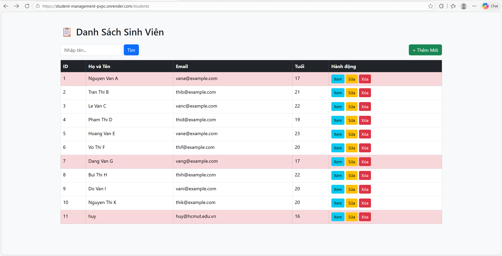
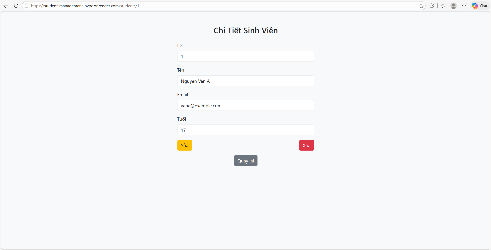
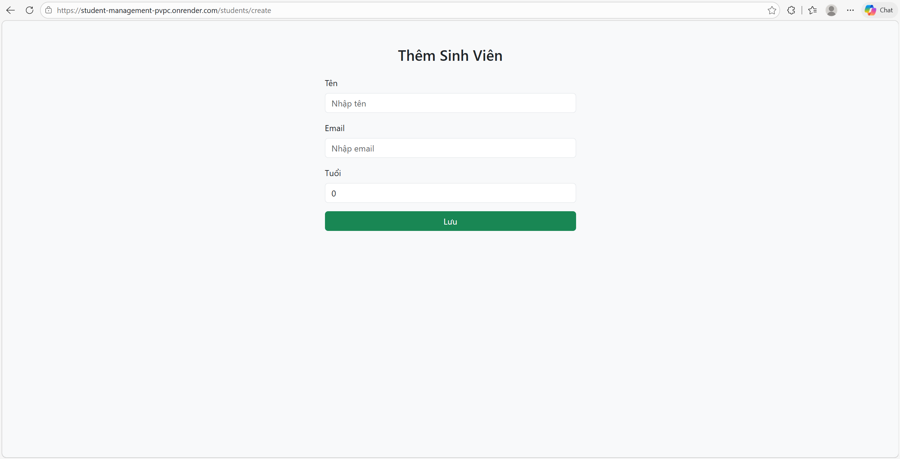
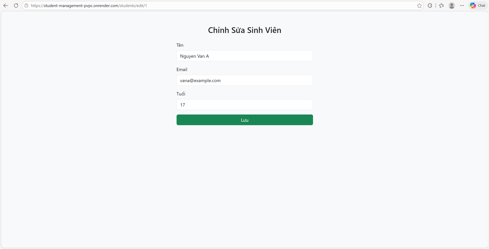

## Thông tin nhóm:
Đào Hữu Gia Huy - 2211158

## Public URL:
https://student-management-pvpc.onrender.com/students

## Hướng dẫn chạy dự án:
### Clone project
```bash
git clone https://github.com/huydao-411/student-management
cd student-management
```
### Cấu hình biến môi trường:
Tạo file .env ở thư mục gốc
```env
SPRING_DATASOURCE_URL=jdbc:postgresql://<host>/<db>
SPRING_DATASOURCE_USERNAME=your_username
SPRING_DATASOURCE_PASSWORD=your_password
```
### Chạy project
Load biến môi trường từ .env(window)
```
Get-Content .env | ForEach-Object {
    if ($_ -match "^\s*([^#][^=]+)=(.*)$") {
        [System.Environment]::SetEnvironmentVariable($matches[1], $matches[2])
    }
}
```

Chạy project
```
./mvnw spring-boot:run
```


## Trả lời câu hỏi lý thuyết:
### Quan sát thông báo lỗi: UNIQUE constraint failed. Tại sao Database lại chặnthao tác này?
-Database chặn vì Primary Key phải là duy nhất.

### Database có báo lỗi không? Từ đó suy nghĩ xem sự thiếu chặt chẽ này ảnh hưởng gì khi code Java đọc dữ liệu lên?
-Nếu cột name không có NOT NULL vẫn insert được. Điều này nguy hiểm vì Java có thể nhận null, dễ gây lỗi NullPointerException.

### Tại sao mỗi lần tắt ứng dụng và chạy lại, dữ liệu cũ trong Database lại bị mất hết?
-Dữ liệu bị mất vì spring.jpa.hibernate.ddl-auto=create.
Mỗi lần chạy lại Hibernate drop toàn bộ bảng rồi tạo lại từ đầu.

## Screenshot:
### Danh sách sinh viên


### Chi tiết sinh viên


### Thêm sinh viên


### Sửa sinh viên
